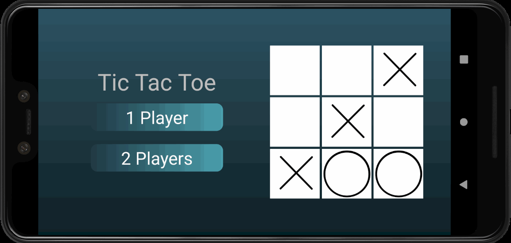
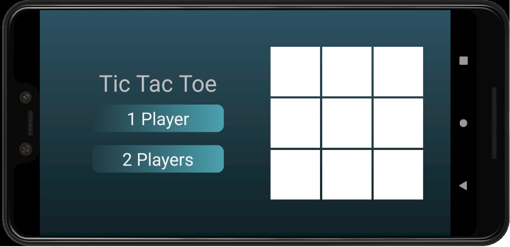

# **Tic Tac Toe**

Interactive Tic Tac Toe ❌⭕ Game for Android 📱

## **Table of contents**

- [**Tic Tac Toe**](#tic-tac-toe)
  - [**Table of contents**](#table-of-contents)
  - [**General info**](#general-info)
  - [**Demo**](#demo)
  - [**Screenshots**](#screenshots)
  - [**Technologies**](#technologies)
  - [**Setup**](#setup)
  - [**Usage**](#usage)
  - [**Status**](#status)
  - [**Contact**](#contact)

## **General info**

**Date**: August, 2019  
**Duration**: 1 Month.

During the summer holidays and after learning the basics of **Java**, I was curious to create my own Android application and looking at tutorials I have created this game of tic tac toe in three languages **English**, **Spanish** and **Russian** with options to play against the computer with 6 different levels (Own algorithm) and option of 2 players on the same screen.

## **Demo**

You can try it downloading the [**Apk**](https://github.com/udsgit/tic-tac-toe/raw/master/apk/tic-tac-toe.apk).

>   
> _Demo_

## **Screenshots**

> 
>
> _Menu screen._

## **Technologies**

- **Android Studio**
- **XML**&nbsp;&nbsp;_(Style)_
- **Java**

## **Setup**

Honestly, this project is over a year old, but I understand that if you download the repository and import the project into Android Studio you can use it.

```console
git clone https://github.com/udsgit/tic-tac-toe.git
```

## **Usage**

1. Just download and install the [**Apk**](https://github.com/udsgit/tic-tac-toe/raw/master/apk/tic-tac-toe.apk). (You may have to accept the option to install third-party apps outside of the Play Store)
2. The game will change languages according to the language of your phone (English, Spanish or Russian).
3. Just choose **1 player** and you will have up to 6 different levels or choose **2 Players**.
4. Enjoy.

## **Status**

Project is: **_Completed._**

Because the game works 100%.

## **Contact**

Created by [@Emmanuel](https://www.linkedin.com/in/emagleza/), feel free to contact me!
